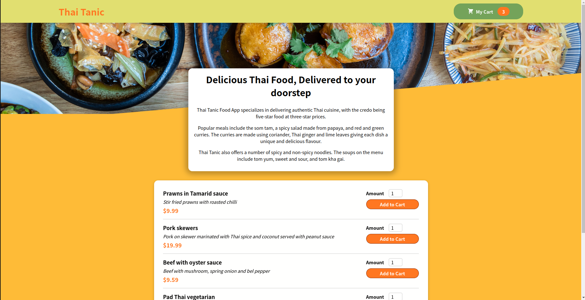
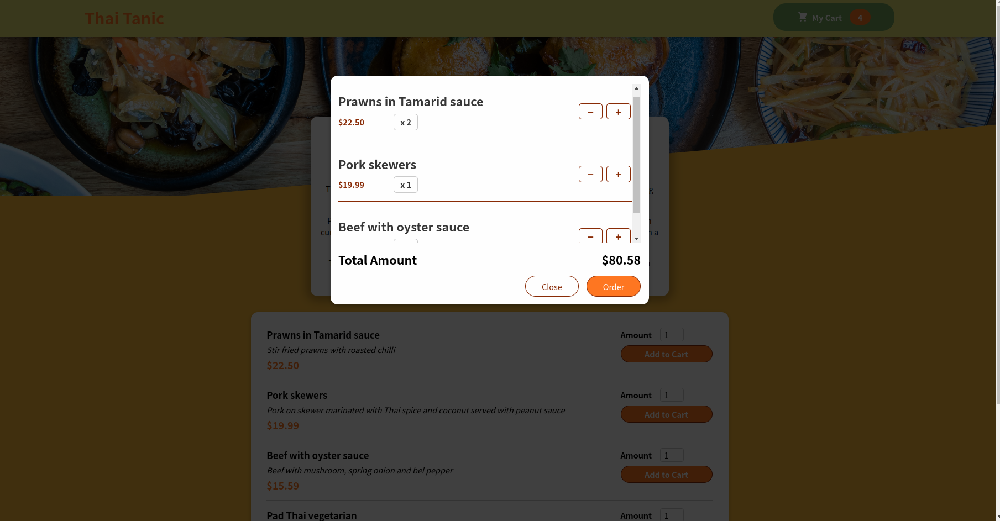

# Thai Tanic

Thai Tanic is a pun-tastic React web application that allows uses to make orders of their favorite Thai dishes. The application is built with the [React framework](https://reactjs.org/).

## Preview

## Built With

- **REACT** and **CSS** and **Javascript**

# Getting Started

*To get a local copy up and running follow these setup steps below.*

### Setup

- Simply fork this project
- run `npm i `to install all dependencies
- run `npm run build` to bundle the project with webpack, and
- run `npm start` to launch the application
- Open [http://localhost:3000](http://localhost:3000) to view it in your browser.

# Author

👤 **Ben**

- GitHub: [Ben Kiarie](https://github.com/Benmuiruri)
- Twitter: [Optimize](https://twitter.com/_optimize)
- LinkedIn: [Ben Kiarie](https://www.linkedin.com/in/benjamin-kiarie-180b66149/)

# 🤝 Contributing

Contributions, issues, and feature requests are welcome!

Feel free to check the [issues page](https://github.com/Benmuiruri/thai-tanic/issues).

# Show your support

Give a ⭐️ if you like this project!

# Acknowledgement

- Hat tip to [@max](https://twitter.com/maxedapps)

# 📝 License

This project is [MIT](./MIT.md) licensed.
